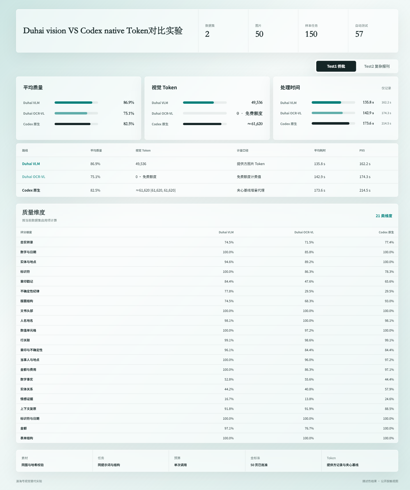

# Duhai Vision

> 用 PaddleOCR-VL 或 Qwen 替换 Codex 内置视觉输入，让 Codex 继续负责推理、编排和最终回答。

[](LICENSE)
[](skills/duhai-vision/SKILL.md)
[](https://aistudio.baidu.com/paddleocr/task)

Duhai Vision 是一个 Codex 全局视觉替代技能。图片先交给外部视觉服务提取结构化观察，Codex 再基于文本结果完成判断。默认走 PaddleOCR-VL；UI、照片和通用视觉语义更适合 Qwen 时，技能会先说明原因再切换。



## 为什么使用

- **全局替换**：安装后，Codex 遇到截图、图表、文档、OCR 或图片任务时优先调用 Duhai Vision。
- **先说明再调用**：每个任务先简要说明任务类型、推荐路线、限额与 Token 可观测性。
- **Paddle 默认**：适合古籍、侨批、表格、公式、印章、版面和长文档。
- **Qwen 后备**：适合 UI、照片、商品、细粒度语义和开放式视觉理解。
- **可审计**：保留提供方、模型、耗时、页数和可获得的 Token 数据，不把未知值写成 0。

## 30 秒安装

### 1. 获取 Paddle Access Token

1. 注册或登录 [百度 AI Studio](https://aistudio.baidu.com/)。
2. 打开 [AI Studio Access Token 页面](https://aistudio.baidu.com/account/accessToken)，创建或复制 Access Token；也可从 [PaddleOCR 官方 API 任务页](https://aistudio.baidu.com/paddleocr/task)的调用示例进入。
3. 该值在本技能中保存为环境变量 `PADDLEOCR_ACCESS_TOKEN`，不要写入仓库或提示词。

### 2. 安装并启用全局替换

```powershell
git clone https://github.com/hamliy-feng/duhai-vision.git
cd duhai-vision
powershell -ExecutionPolicy Bypass -File .\install.ps1 `
  -InstallDependencies
```

如果尚未配置 Token，安装器会打开指引并以隐藏输入方式询问，不会把 Token 留在命令历史中。自动化环境可预先设置 `PADDLEOCR_ACCESS_TOKEN`，并加 `-NoCredentialPrompt`。

重启 Codex 后生效。安装器会：

1. 将技能安装到 `~/.agents/skills/duhai-vision`。
2. 将 Paddle 设为默认视觉提供方。
3. 向 `~/.codex/AGENTS.md` 写入可重复更新的全局视觉替换规则。
4. 只把 Token 写入当前用户的环境变量，不写入项目文件。

已经安装依赖时，可去掉 `-InstallDependencies`。检查配置：

```powershell
python .\skills\duhai-vision\scripts\doctor.py
```

## 路线选择

| 路线 | 适合任务 | 默认行为 | 使用提示 |
|---|---|---|---|
| PaddleOCR-VL 1.6 | 文档 OCR、古籍、侨批、表格、公式、印章、版面 | 默认 | AI Studio 社区服务当前按模型提供每日页数额度；SDK 响应不暴露 Token usage |
| Qwen3-VL-Plus | UI、照片、商品、图表、计数、开放式语义 | 明显更适合时切换 | 需要 DashScope API Key；额度与费用以百炼控制台为准 |
| Codex Native | 外部路线均不可用，或用户明确指定 | 仅回退 | 使用时必须说明已发生回退及原因 |

Paddle 官方当前公开限制包括：每用户、每模型每天 3000 页，建议单文件不超过 100 页，超出部分只处理前 100 页。规则可能调整，使用前以[官方调用限制](https://ai.baidu.com/ai-doc/AISTUDIO/Xmjclapam)为准。

## 可选：配置 Qwen

```powershell
powershell -ExecutionPolicy Bypass -File .\install.ps1 `
  -ConfigureQwen
```

安装器会以隐藏输入方式询问 DashScope API Key，默认提供方仍保持 Paddle。Duhai Vision 会在 UI、照片和通用视觉任务中推荐 Qwen，也可显式设置：

```powershell
powershell -ExecutionPolicy Bypass -File .\install.ps1 -Provider qwen
```

## 使用方式

安装完成后，像平常一样把图片交给 Codex：

```text
请转录这页侨批，保留繁体字、印章、不可读位置和推断依据。
```

技能应先给出类似提示：

```text
任务属于文档 OCR 与版面提取，默认使用 PaddleOCR-VL；当前社区额度按页计，
SDK 不返回 Token usage。本次结果将由 Codex 继续结构化并标记不确定项。
```

需要手动调用时：

```powershell
python .\skills\duhai-vision\scripts\paddle_extract.py `
  --image "D:\资料\page-001.jpg" `
  --out ".agent_index\page-001.json"
```

## 实验结果

同一批素材、同 Prompt、同 Schema 的 Test1（30 页）描述性结果：

| 路线 | 平均质量 | 视觉 Token 可观测值 | 当期计费 | 平均耗时 |
|---|---:|---:|---:|---:|
| Duhai VLM | 86.9% | 49,536 | 见实验账本 | 135.8 s |
| Duhai OCR-VL API | 75.1% | N/A（SDK 未暴露） | 0（当期免费额度） | 142.9 s |
| Codex Native | 82.5% | 约 61,620（增量代理） | N/A | 173.6 s |

说明：截图中的 `0 · 免费额度` 是该实验窗口的计费展示，不代表 Paddle API 实际计算量或 Token usage 为 0。Codex Native 数值来自 B1/V/B2 前后夹心基线，是图片输入增量代理，不是官方 `image_tokens`。实验分组不满足确认性独立来源要求，因此这些结果用于工程路线比较，不宣称统计学非劣结论。

## 仓库结构

```text
duhai-vision/
├─ README.md
├─ install.ps1
├─ assets/experiment-results.png
└─ skills/duhai-vision/
   ├─ SKILL.md
   ├─ agents/openai.yaml
   ├─ references/provider-setup.md
   └─ scripts/
```

## 安全

- 所有凭据只从环境变量读取。
- `.env`、输出目录和本地索引默认不进入 Git。
- 远程视觉服务会接收图片内容；涉及身份证件、地址、电话或未公开档案时，先脱敏或改用本地方案。

## License

[MIT](LICENSE)
