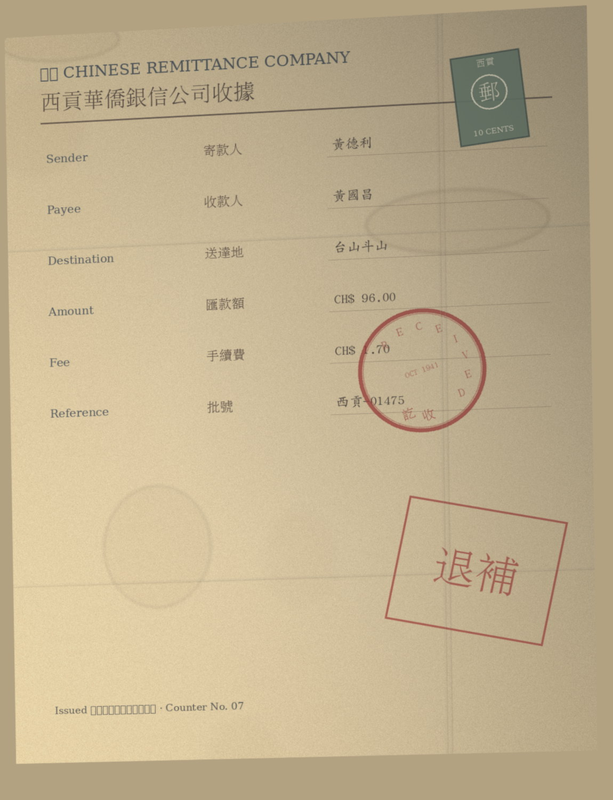
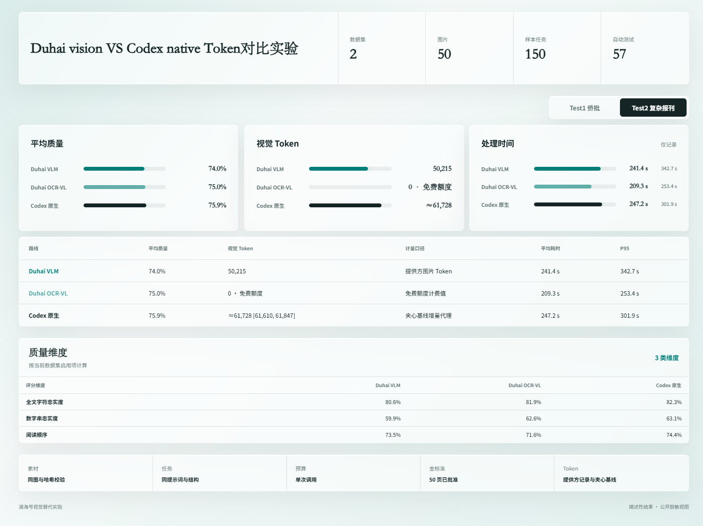
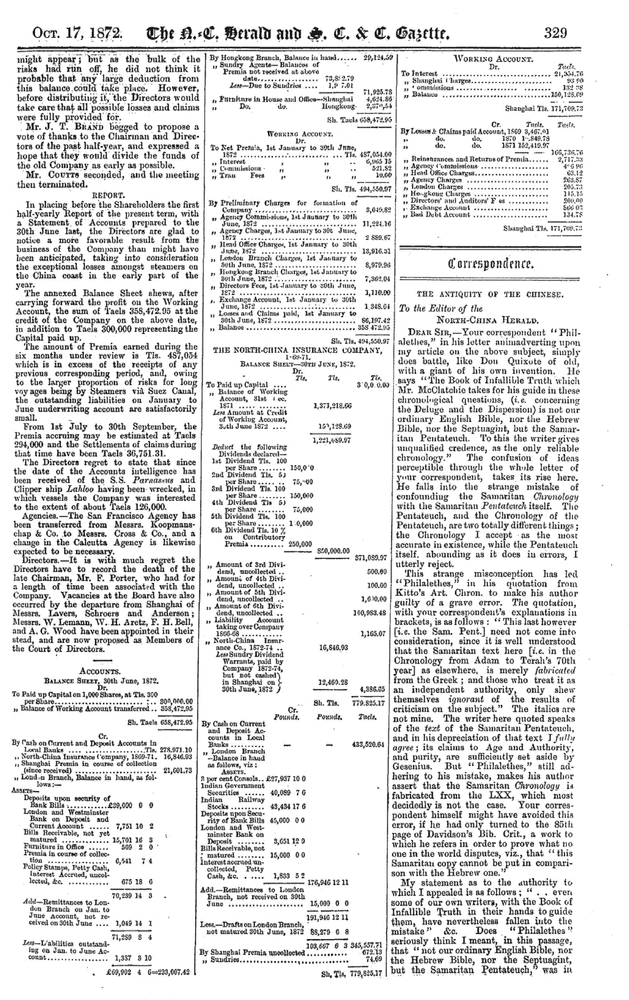

<div align="center">
  <h1>👁️ Duhai Vision</h1>
  <p><strong>给 Codex 与 DSH 换一双免费、可替换且不影响视觉质量的眼睛。</strong></p>
  <p>
    <a href="LICENSE"></a>
    <a href="skills/duhai-vision/SKILL.md"></a>
    <a href="cordis.patch.yml"></a>
    <a href="https://aistudio.baidu.com/paddleocr/task"></a>
  </p>
  <p>
    <a href="#测试结果">测试结果</a> ·
    <a href="#快速安装">快速安装</a> ·
    <a href="#路线选择">路线选择</a> ·
    <a href="#使用方式">使用方式</a> ·
    <a href="#卸载">卸载</a> ·
    <a href="#安全">安全</a>
  </p>
  <p>🧩 Duhai Vision 是视觉模型适配器：Codex 或 DSH 将图片任务组织成问题式 JSON，等待视觉能力返回结构化结果后再继续分析。Codex 通过 Skill 启用全局视觉路由，DSH 通过 <code>duhai_vision</code> 工具调用同一套 PaddleOCR-VL / Qwen 执行器。当前文档与 OCR 默认优先使用 PaddleOCR-VL，AI Studio 当前为每位用户、每个模型提供每天 3000 页免费解析额度。</p>
</div>

- 🧩 “不要使用固定的图片识别入口” → **切换为可替换的视觉模型适配器**
- 📤 “图片任务怎样交给视觉模型” → **按问题式 JSON 发送并等待结构化回调**
- 🔁 “视觉结果返回后怎么办” → **交回 Codex 或 DSH 继续推理、验证和回答**
- 📄 “帮我读文档、表格、古籍或报刊” → **默认优先 PaddleOCR-VL**
- 🖼️ “帮我看 UI、照片、商品或开放场景” → **仍先使用 PaddleOCR-VL，必要时再显式切换 Qwen**
- 🎁 “每天有多少免费额度” → **每位用户、每个模型当前 3000 页，以[官方规则](https://ai.baidu.com/ai-doc/AISTUDIO/Xmjclapam)为准**

## 测试结果

<p align="center">
  <strong>Test1 · 侨批</strong>
</p>
<p align="center">
  <a href="assets/experiment-results.png">
    
  </a>
</p>
<p align="center"><sub>点击图片查看完整原图</sub></p>

<p align="center">
  <strong>Test1 代表样本</strong>
</p>
<p align="center">
  <a href="assets/samples/test1/sample_025.jpg">
    
  </a>
</p>
<p align="center"><sub><a href="assets/samples/test1">查看 Test1 全部 10 张测试图片</a></sub></p>

<br>

<p align="center">
  <strong>Test2 · 复杂报刊</strong>
</p>
<p align="center">
  <a href="assets/test2-results.png">
    
  </a>
</p>
<p align="center"><sub>点击图片查看完整原图</sub></p>

<p align="center">
  <strong>Test2 代表样本</strong>
</p>
<p align="center">
  <a href="assets/examples/test2-page-13-cropped.png">
    
  </a>
</p>
<p align="center"><sub><a href="assets/samples/test2">查看 Test2 全部 20 张测试图片</a> · 代表图仅裁去正文下方的非正文提示行</sub></p>

两组测试素材均已获得组织授权公开。每组测试中的三条路线采用相同 Prompt 与 Schema，结果仅用于工程路线比较，不宣称统计学结论。截图中的 `0 · 免费额度` 是实验窗口的计费展示，不代表 Paddle API 实际计算量或 Token usage 为 0；Codex Native 数值是图片输入增量代理，不是官方 `image_tokens`。

## 为什么需要 Duhai Vision

Codex 与 DSH 在批量 OCR、长文档和可重复视觉任务里，需要明确路线选择、额度边界、Token 口径和失败处理。Duhai Vision 把这些决策固化成统一能力层：

- **双端适配**：Codex 使用全局 Skill 路由；DSH 使用模型可调用的 `duhai_vision` 工具。
- **先说明再调用**：每个任务先简要说明任务类型、推荐路线、限额与 Token 可观测性。
- **Paddle 默认**：适合古籍、侨批、表格、公式、印章、版面和长文档。
- **Qwen 后备**：仅在用户明确指定，或 PaddleOCR-VL 不可用且需要语义后备时启用。
- **可审计**：保留提供方、模型、耗时、页数和可获得的 Token 数据，不把未知值写成 0。
- **有边界的回退**：外部路线不可用或用户明确指定时，才使用 Codex Native，并说明原因。

## PaddleOCR-VL 与 Codex Native 路径对比

两条路线的区别不在于谁负责最终回答，而在于**图片先经过哪一层完成视觉提取**。无论选择哪条路线，Codex 本地 Agent 都继续负责任务理解、工具编排、结果验证和最终回答。

| 对比项 | Codex Native | Duhai Vision + PaddleOCR-VL |
|---|---|---|
| 图片入口 | 图片直接进入 Codex 内置视觉通道 | 本地 Agent 先调用 Duhai Vision，再由 PaddleOCR-VL 解析 |
| 返回给 Agent 的内容 | 内置视觉上下文 | 结构化 JSON、正文、版面、表格、公式、印章与不确定项 |
| 默认适用范围 | 通用图片理解与外部路线回退 | 文档 OCR、古籍、侨批、报刊、表格、公式和复杂版面 |
| 视觉模型 | 由 Codex Native 提供 | PaddleOCR-VL 1.6 默认优先；Qwen 仅显式选择或失败后备 |
| 调用与额度 | 计入 Codex 图片输入上下文 | Paddle 社区服务当前每用户、每模型每天 3000 页免费额度 |
| 可替换性 | 使用 Codex 内置入口 | 提供方、模型与路由规则均可替换 |
| 可审计性 | 由 Codex 会话统一承载 | 明确记录提供方、模型、页数、耗时、结果与不确定项 |
| 失败处理 | 由 Codex Native 继续处理 | 最多一次主提取和一次定向验证；失败后说明原因并回退 Native |

### Codex 本地 Agent 的两条调用路径

```text
Codex Native
用户图片 → Codex 本地 Agent → Codex 内置视觉通道 → 视觉上下文 → Agent 推理与回答

Duhai Vision
用户图片 → Codex 本地 Agent → Duhai Vision 路由 → PaddleOCR-VL
         → 结构化视觉观察 JSON → Agent 交叉验证、推理与回答
```

### Duhai Vision 的优化与贡献

- **视觉能力解耦**：把图片识别从固定入口拆成可替换的视觉适配层，不改变 Codex 的推理与工具编排能力。
- **文档路线优化**：默认把 OCR、古籍、侨批、报刊、表格、公式、印章和复杂版面交给 PaddleOCR-VL。
- **减少图片上下文占用**：先将图片转换为紧凑的结构化观察，再交回 Codex 分析；实验中的实际差异见上方 Test1 与 Test2。
- **额度优先路由**：优先使用 Paddle 当前每日 3000 页免费额度，并在调用前说明页数限制与 Token 可观测边界。
- **统一双端能力**：同一仓库同时服务 Codex Skill 与 DSH Plugin，两端复用相同的路由、执行器和返回结构。
- **全链路可审计**：保留模型、提供方、耗时、页数、不确定项和可获得的 usage，避免把未暴露的数据记为 0。
- **质量保护机制**：默认允许一次主提取与一次裁剪、重试或定向验证；重要字段仍由 Agent 结合文件、文本或其他证据复核。
- **平滑回退**：PaddleOCR-VL 与 Qwen 均不可用时才回退 Codex Native，原有任务不会因外部视觉路线失效而中断。

## 快速安装

### DSH

安装 PaddleOCR-VL 运行依赖：

```powershell
python -m pip install "paddleocr>=3.4,<4"
```

配置 Paddle Access Token：

```powershell
$env:PADDLEOCR_ACCESS_TOKEN = "<你的 Access Token>"
[Environment]::SetEnvironmentVariable(
  "PADDLEOCR_ACCESS_TOKEN",
  "<你的 Access Token>",
  "User"
)
```

可选配置 Qwen：

```powershell
$env:VLM_API_KEY = "<你的 DashScope API Key>"
[Environment]::SetEnvironmentVariable(
  "VLM_API_KEY",
  "<你的 DashScope API Key>",
  "User"
)
```

将插件安装到 DSH Web profile：

```powershell
dsh plugin --profile web add github:hamliy-feng/duhai-vision
dsh web
```

Linux 与 macOS：

```bash
python3 -m pip install "paddleocr>=3.4,<4"
export PADDLEOCR_ACCESS_TOKEN="<你的 Access Token>"
# 可选：export VLM_API_KEY="<你的 DashScope API Key>"
dsh plugin --profile web add github:hamliy-feng/duhai-vision
dsh web
```

安装后，DSH 会获得模型工具 `duhai_vision`。工具接收本地图片路径、视觉问题和可选提供方；`auto` 对所有支持的视觉任务均先使用 PaddleOCR-VL，不会因为 UI、照片、商品或开放场景关键词自动切换 Qwen。

从本地仓库安装：

```powershell
dsh plugin --profile web add .
```

检查 Bundle 已进入 Web profile：

```powershell
dsh --profile web --dump-config
```

### Codex

也可以直接把这句话交给 Codex：

```text
请安装并全局启用 Duhai Vision：
https://github.com/hamliy-feng/duhai-vision
按仓库 README 完成 Paddle Access Token、依赖和 doctor 检查。
```

#### 1. 获取 Paddle Access Token

1. 注册或登录 [百度 AI Studio](https://aistudio.baidu.com/)。
2. 打开 [AI Studio Access Token 页面](https://aistudio.baidu.com/account/accessToken)，创建或复制 Access Token；也可从 [PaddleOCR 官方 API 任务页](https://aistudio.baidu.com/paddleocr/task)的调用示例进入。
3. 该值在本技能中保存为环境变量 `PADDLEOCR_ACCESS_TOKEN`，不要写入仓库或提示词。

#### 2. 命令行下载

使用 GitHub CLI：

```powershell
gh repo clone hamliy-feng/duhai-vision
cd duhai-vision
```

或使用 Git：

```powershell
git clone https://github.com/hamliy-feng/duhai-vision.git
cd duhai-vision
```

不使用 Git 时也可下载源码压缩包：

```powershell
curl.exe -L https://github.com/hamliy-feng/duhai-vision/archive/refs/heads/main.zip `
  -o duhai-vision.zip
Expand-Archive .\duhai-vision.zip -DestinationPath .
cd .\duhai-vision-main
```

#### 在你使用前，先知道这些

| 项目 | 默认行为 |
|---|---|
| 默认路线 | PaddleOCR-VL 1.6，优先处理文档、OCR、表格、公式、印章与版面 |
| 通用视觉 | UI、照片、商品、计数和开放式语义仍先使用 PaddleOCR-VL；Qwen 只接受显式选择或失败后备 |
| 全局范围 | 技能安装到 `~/.agents/skills`，路由规则写入 `~/.codex/AGENTS.md`，重启 Codex 后生效 |
| 调用预算 | 每个视觉任务默认最多 2 次外部调用：一次主提取，一次重试、裁剪或定向验证 |
| 隐私 | 远程提供方会收到图片；敏感材料应先脱敏，或不要走远程路线 |
| 诊断 | `doctor.py` 会检查默认路线、依赖、Key、Node、全局规则与技能安装状态 |

#### 3. 先检查，再显式安装

```powershell
# 默认只读检查：不会安装依赖、复制 Skill、写全局规则或保存 Key
powershell -ExecutionPolicy Bypass -File .\install.ps1

# 确认后再安装 Skill、依赖并启用 Codex 全局视觉替换
powershell -ExecutionPolicy Bypass -File .\install.ps1 `
  -Apply `
  -InstallDependencies
```

如果尚未配置 Token，安装器会打开指引并以隐藏输入方式询问，不会把 Token 留在命令历史中。自动化环境可预先设置 `PADDLEOCR_ACCESS_TOKEN`，并加 `-NoCredentialPrompt`。

重启 Codex 后生效。安装器会：

1. 将技能安装到 `~/.agents/skills/duhai-vision`。
2. 将 Paddle 设为默认视觉提供方。
3. 向 `~/.codex/AGENTS.md` 写入可重复更新的全局视觉替换规则。
4. 只把 Token 写入当前用户的环境变量，不写入项目文件。

已经安装依赖时，可去掉 `-InstallDependencies`。检查配置：

```powershell
python .\skills\duhai-vision\scripts\doctor.py
```

#### 安装方式

| 方式 | 命令 | 适合场景 |
|---|---|---|
| 默认安全检查 | `powershell -File .\install.ps1` | 所有环境；只读检查并列出 Skill、规则、运行时与 Key 状态 |
| 显式安装 | `powershell -File .\install.ps1 -Apply` | 已有 `paddleocr` 依赖，只安装 Skill 与全局规则 |
| 显式安装依赖 | `powershell -File .\install.ps1 -Apply -InstallDependencies` | 明确允许通过 pip 安装或更新依赖 |
| 兼容安全参数 | `powershell -File .\install.ps1 -Safe` | 与默认只读检查相同 |
| 仅预览 | `powershell -File .\install.ps1 -Apply -InstallDependencies -DryRun` | 预览目标路径、依赖与环境配置，不做任何写入 |

自动化环境可预先设置 `PADDLEOCR_ACCESS_TOKEN`，并使用 `-Apply -NoCredentialPrompt`。当前一键全局安装器面向 Windows PowerShell；Skill 内的 Python 和 Node 执行器可独立复用。

## 路线选择

| 路线 | 适合任务 | 默认行为 | 使用提示 |
|---|---|---|---|
| PaddleOCR-VL 1.6 | 文档 OCR、古籍、侨批、表格、公式、印章、版面 | 默认 | AI Studio 社区服务当前按模型提供每日页数额度；SDK 响应不暴露 Token usage |
| Qwen3-VL-Plus | Paddle 不可用后的语义后备，或用户明确指定 | 不自动选择 | 需要 DashScope API Key；额度与费用以百炼控制台为准 |
| Codex Native | 外部路线均不可用，或用户明确指定 | 仅回退 | 使用时必须说明已发生回退及原因 |

Paddle 官方当前公开限制包括：每用户、每模型每天 3000 页，建议单文件不超过 100 页，超出部分只处理前 100 页。规则可能调整，使用前以[官方调用限制](https://ai.baidu.com/ai-doc/AISTUDIO/Xmjclapam)为准。

## 可选：配置 Qwen

```powershell
powershell -ExecutionPolicy Bypass -File .\install.ps1 `
  -Apply `
  -ConfigureQwen
```

安装器会以隐藏输入方式询问 DashScope API Key，默认提供方仍保持 Paddle。Duhai Vision 不会按任务关键词自动切换 Qwen；如确有需要，可由用户显式设置：

```powershell
powershell -ExecutionPolicy Bypass -File .\install.ps1 -Apply -Provider qwen
```

## 使用方式

安装完成后，像平常一样把图片交给 Codex，或告诉 DSH 图片路径：

```text
请转录这页侨批，保留繁体字、印章、不可读位置和推断依据。
```

DSH 示例：

```text
使用 Duhai Vision 读取 C:\资料\page-001.jpg，转录正文、印章和表格，标记不确定项。
```

DSH 会调用：

```json
{
  "image": "C:\\资料\\page-001.jpg",
  "question": "转录正文、印章和表格，标记不确定项",
  "provider": "auto"
}
```

技能应先给出类似提示：

```text
任务属于文档 OCR 与版面提取，默认使用 PaddleOCR-VL；当前社区额度按页计，
SDK 不返回 Token usage。本次结果将由 Codex 或 DSH 继续结构化并标记不确定项。
```

需要手动调用时：

```powershell
python .\skills\duhai-vision\scripts\paddle_extract.py `
  --image "D:\资料\page-001.jpg" `
  --out ".agent_index\page-001.json"
```

## 设计理念

Duhai Vision 是视觉观察层，不是最终真相，也不是另一个聊天机器人：

```text
图片 / PDF / 截图
        ↓
PaddleOCR-VL（默认）或 Qwen（通用视觉）
        ↓
结构化观察 + 不确定项 + 可观测 usage
        ↓
Codex / DSH 验证、推理并完成最终回答
```

路由选择、额度披露、调用上限和回退条件写在 Skill 与全局规则里。模型输出只作为观察；重要数字、姓名、日期、表格关系和警告仍应交叉验证。

## 仓库结构

```text
duhai-vision/
├─ README.md
├─ package.json
├─ cordis.patch.yml
├─ dsh/
│  ├─ index.js
│  └─ index.test.mjs
├─ install.ps1
├─ uninstall.ps1
├─ assets/
│  ├─ experiment-results.png
│  ├─ test2-results.png
│  ├─ examples/test2-page-13-cropped.png
│  └─ samples/
│     ├─ test1/（10 张）
│     └─ test2/（20 张）
└─ skills/duhai-vision/
   ├─ SKILL.md
   ├─ agents/openai.yaml
   ├─ references/provider-setup.md
   └─ scripts/
```

## 安全

- 所有凭据只从环境变量读取。
- `.env`、输出目录和本地索引默认不进入 Git。
- 远程视觉服务会接收图片内容；涉及身份证件、地址、电话或未公开档案时，先脱敏或改用本地方案。

## 卸载

从 DSH Web profile 卸载：

```powershell
dsh plugin --profile web remove duhai-vision
```

卸载 Codex Skill：

先预览，不做任何删除：

```powershell
powershell -ExecutionPolicy Bypass -File .\uninstall.ps1 -DryRun
```

移除已安装 Skill 和 Duhai Vision 受管全局规则，默认保留提供方 Key：

```powershell
powershell -ExecutionPolicy Bypass -File .\uninstall.ps1

# 与默认行为相同：明确保留 Key，便于之后重装
powershell -ExecutionPolicy Bypass -File .\uninstall.ps1 -KeepConfig
```

只有确定这些环境变量没有被其他工具共用时，才同时删除安装器管理的配置：

```powershell
powershell -ExecutionPolicy Bypass -File .\uninstall.ps1 -RemoveCredentials
```

卸载器不会删除仓库目录，也不会自动卸载可能被其他项目共用的 `paddleocr` 包。如果确认不再使用，可另行执行：

```powershell
python -m pip uninstall paddleocr
```

## ⭐ 为什么值得 Star

这个项目来自真实的 Duhai Vision / Codex Native 对照实验，也会继续用于日常视觉工作流。

- PaddleOCR、Qwen、Codex、DSH 或官方额度发生变化时，会持续更新路由和说明。
- 新的文档、UI、图表和批量图片场景会逐步补充到技能与验证流程。
- 路线失效、额度变化或解析问题都欢迎直接提交 Issue。

Star 一下，下次需要给 Codex 或 DSH 更换视觉路线时能直接找到。⭐

## License

[MIT](LICENSE)
